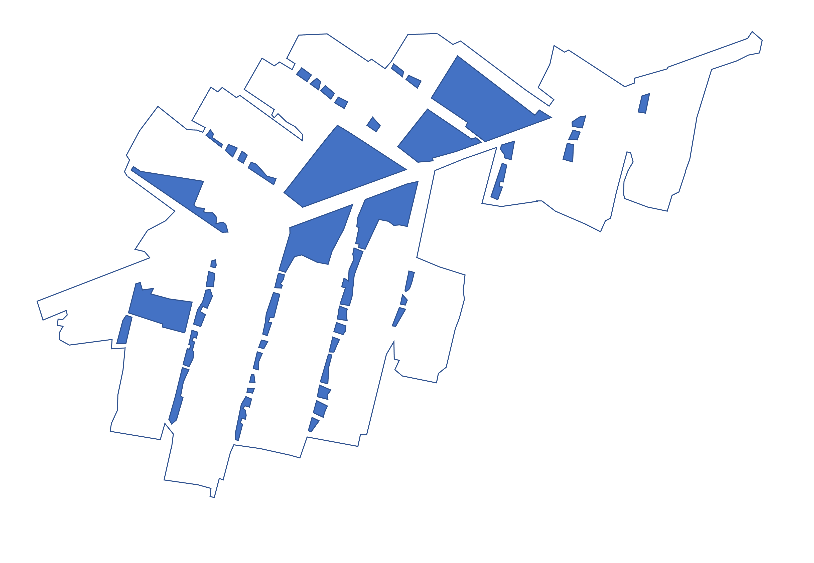
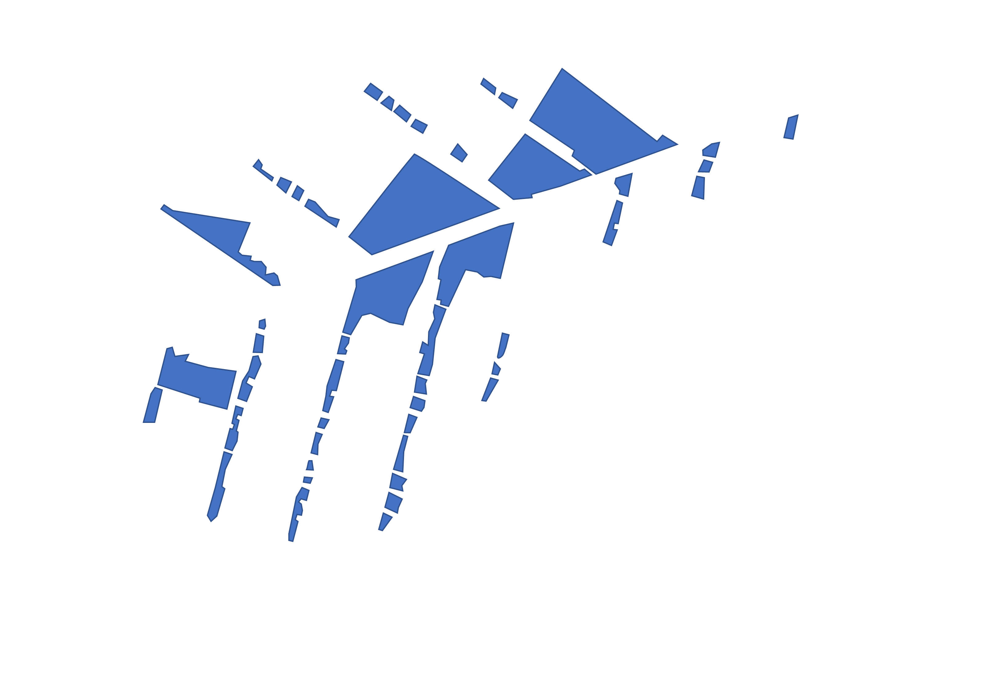
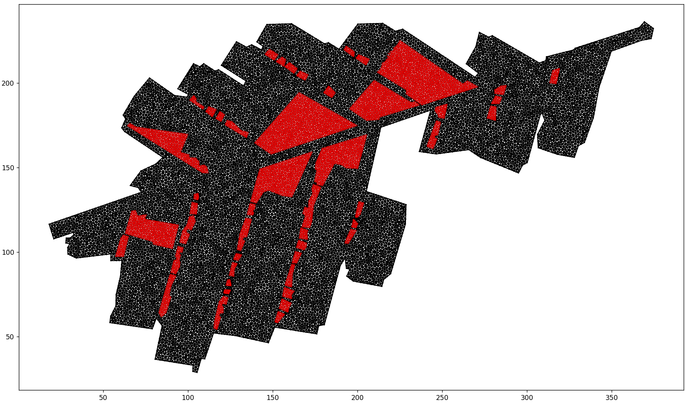

# Pillar Mesher

The most efficient way to mesh an image of a mining layout or any 2D space with irregular polygons.

## Process
### 1. Save vertex coordinates of outer border
**Needed:** PNG image of the 2D layout with all polygons. Make sure there are no unnecessary shapes on the image and ensure the outline is a closed polygon. (Higher quality images provide more accurate vertices)

Example: 

1. Upload this image to the program using the 'u' key on your keyboard and choosing it.

2. Now adjust the epsilon (sensitivity) scrollbar to highlight the correct vertices of the border. The vertices are highlighted with a coloured circle on the image. Then save the coordinates of these vertices by pressing 'b' on your keyboard. 

3. An input box should open asking for the max grid coordinates. This is to normalize the image pixels to a specified grid size chosen by the user. Enter the max grid x coordinate and in the next popup the max grid y coordinate.

The border polygon coordinates will then be saved in a Data folder under 'border.txt' in your current directory.

### 2. Save vertex coordinates of the inner irregular polygons
**Needed:** PNG image of the 2D layout with all polygons **except the border**. Note: This image should be the exact same size and quality as the previous one. Make sure there are no unnecessary shapes on the image and ensure the outline is a closed polygon. (Higher quality images provide more accurate vertices)

Example: 

Now follow the exact same steps as the border except you save the coordinates with the 'p' keyboard button.

The inner polygons will be saved to a Data folder under 'pillars.txt' in your current directory.

### 3. Mesh the plane with all polygons

Once you saved the necessary coordinates in step 1 and 2 you can mesh your 2D plane by pressing 'm' on your keyboard.

A popup will appear asking for the max area which is the max area of the mesh traingles. Smaller areas provide more accurate meshes but take longer to mesh.

The mesh will now generate.

### 4. Quality control the generated mesh by viewing it

After mesh generation 2 things happen:
- Your mesh data will be stored inside /Data/Mesh. Each polygon will have its own text file with a list of triangles with each triangle coordinates on a different line. It is stored in the format: (x1, y1, x2, y2, x3, y3). Inside polygons will have their own text file starting with a 'P{Number}.txt' and the border polygon's mesh is inside 'M1.txt'.

- A new screen will appear in which you can view the generated mesh. At the bottom left are tools to view, zoom and save an image of the mesh. Note: For large meshes the screen manipulations will be slow because of the large amount of triangles. Use this plot to check the quality of the mesh. Eg: 

